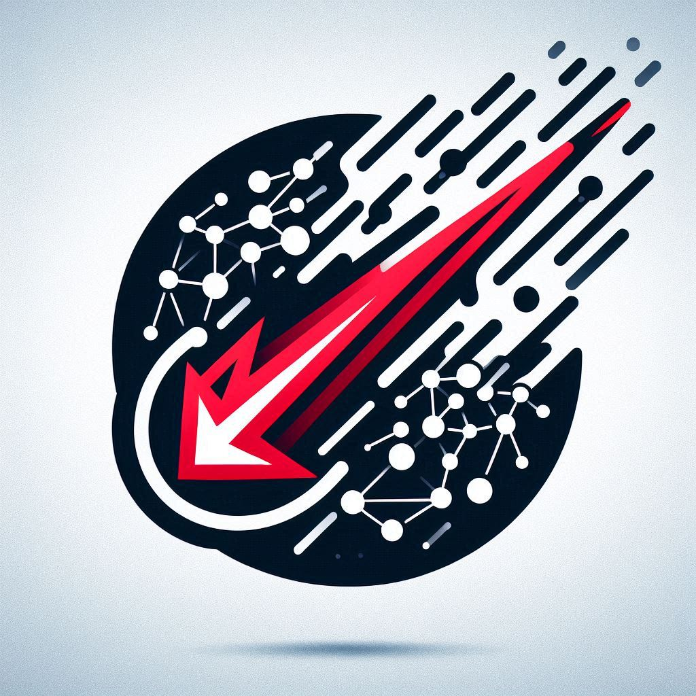

# Starfall



----

Starfall is an “Upgrade Copilot” — an AI-powered assistant that automates the boring, error-prone upgrade research for Kubernetes clusters and their installed tools.

Instead of you manually checking:
- “What version of Grafana is running?”
- “What’s the latest version?”
- “Are there breaking changes?”
- “How should I upgrade it safely?”

…this assistant will scan your cluster, pull the right info from the internet, summarize the relevant upgrade notes, and optionally push those insights where you want them (Slack, GitHub issue, email, etc.).


# Local setup

## Python
```bash
# Start a Python Virtual Env
python3 -m venv .venv
source .venv/bin/activate

pip install --upgrade pip setuptools wheel
pip install ipython
```

## CrewAI
> https://docs.crewai.com/en/installation

```bash

# Install
curl -LsSf https://astral.sh/uv/install.sh | sh
uv tool install crewai
uv tool list

# Generate Project Scaffolding
crewai create crew starfall
```

<details>
  <summary>Expand to see creation output</summary>
  
  ```bash
    Creating folder starfall...
    Cache expired or not found. Fetching provider data from the web...
    Downloading  [####################################]  663179/30913
    Select a provider to set up:
    1. openai
    2. anthropic
    3. gemini
    4. nvidia_nim
    5. groq
    6. huggingface
    7. ollama
    8. watson
    9. bedrock
    10. azure
    11. cerebras
    12. sambanova
    13. other
    q. Quit
    Enter the number of your choice or 'q' to quit: 7

    Select a model to use for Ollama:
    1. ollama/llama3.1
    2. ollama/mixtral
    q. Quit
    Enter the number of your choice or 'q' to quit: 1

    API keys and model saved to .env file
    Selected model: ollama/llama3.1
    - Created starfall/.gitignore
    - Created starfall/pyproject.toml
    - Created starfall/README.md
    - Created starfall/knowledge/user_preference.txt
    - Created starfall/src/starfall/__init__.py
    - Created starfall/src/starfall/main.py
    - Created starfall/src/starfall/crew.py
    - Created starfall/src/starfall/tools/custom_tool.py
    - Created starfall/src/starfall/tools/__init__.py
    - Created starfall/src/starfall/config/agents.yaml
    - Created starfall/src/starfall/config/tasks.yaml
    Crew starfall created successfully!
  ```
</details>
<br>


The project will contain these essential files:

|File|Purpose|
|---|---|
|agents.yaml|	Define your AI agents and their roles|
|tasks.yaml|	Set up agent tasks and workflows|
|.env	|Store API keys and environment variables|
|main.py|	Project entry point and execution flow|
|crew.py|	Crew orchestration and coordination|
|tools/	| Directory for custom agent tools|
|knowledge/|	Directory for knowledge base|
