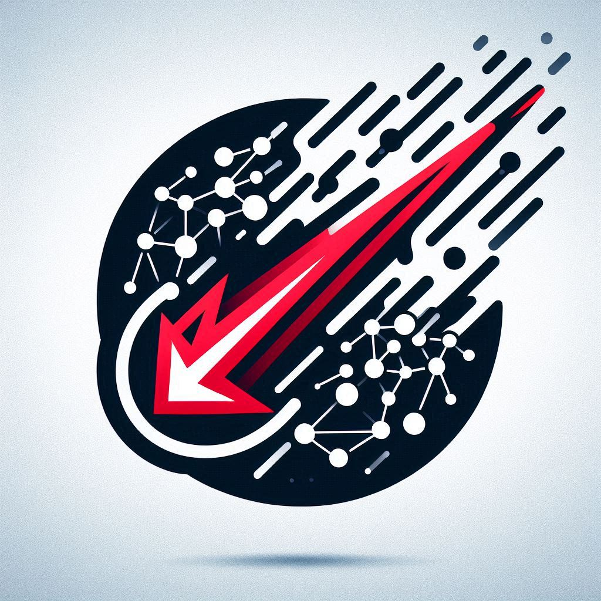

# Starfall



> AI-powered upgrade helper for Kubernetes clusters and the software you run on them.

---

## Overview

Starfall is an "Upgrade Helper": it automates the repetitive and error‑prone work of researching upgrade paths for your Kubernetes control plane and in-cluster applications.

Instead of manually answering:
* What version is currently running?
* What is the latest stable version?
* Are there breaking changes or relevant release notes?
* What is the safest upgrade path?

Starfall:
1. Scans the cluster (control plane + selected workloads)
2. Collects version + metadata
3. Looks up latest stable releases
4. Summarizes meaningful upgrade notes (planned capability)
5. Prepares actionable insights (e.g. Slack / GitHub Issue / Email)

## Architecture Diagram


## Key Features (current & planned)

| Area | Status | Notes |
|------|--------|-------|
| Kubernetes control plane version detection | ✅ | Captures current + latest version
| Workload container image version extraction | ✅ | Parses Deployments (selectively via labels)
| Latest release lookup | ✅ (basic) | Uses external release sources (currently GitHub)
| Structured task delegation to AI agents | ✅ | CrewAI powered
| Release notes summarization | ✅ | Planned enhancement
| Delivery integrations (Slack / GitHub issues) | ⏳ | Planned
| Safety / diff heuristics | ⏳ | Planned

## Tech Stack

* Python (uv + virtualenv)
* CrewAI for multi‑agent orchestration
* GPT-4 as the LLM provider
* Kubernetes (scan target)

## Repository Layout (selected)

| Path | Purpose |
|------|---------|
| `src/starfall/crew.py` | Crew & agent orchestration entry points |
| `src/starfall/main.py` | CLI / execution entry |
| `src/starfall/tools/k8s_scanner.py` | Cluster + workload scanning tool |
| `src/starfall/pydantic_models.py` | Data models (versions, apps, etc.) |
| `knowledge/` | User / domain guidance for agents |
| `outputs/` | Generated scan reports (JSON) |
| `docs/` | Roadmap, tools overview, performance notes |

## Getting Started

### 1. Prerequisites
* Python 3.11+ (align with your local environment)
* Access to a Kubernetes cluster (or kind/minikube)
* OpenAI key
* Git + curl

### 2. Environment Setup
```bash
python3 -m venv .venv
source .venv/bin/activate

# Install UV
curl -LsSf https://astral.sh/uv/install.sh | sh

# Install project dependencies
uv sync --frozen
```

### 3. Configure LLM Provider
Update `.env` with any required provider configuration
```bash
BRAVE_API_KEY=Bxxxxxx
MODEL=gpt-4o-mini
OPENAI_API_KEY=skxxxxxxxxxxxx
```

## Running a Scan (Conceptual Flow)

```bash
uv run crewai run
```

1. Invoke the scanner tool (code in `k8s_scanner.py`) to produce an initial JSON snapshot (e.g. `initial_k8s_scanner_report.json`).
2. Agents receive structured tasks derived from that snapshot.
3. Release intelligence specialist agents look up the latest stable versions.
4. A manager agent aggregates findings into `final_k8s_scanner_report.json`.
5. Crews pick up the JSON file and find release notes.


## Development Notes

* Use labels (e.g. `starfall.io/enabled=true`) to scope which workloads are scanned.
* Extend scanning logic by adding new collectors under `tools/`.
* Pydantic models enforce structure—update them if you add fields.

## Roadmap & Docs

See:
* `docs/ROADMAP.md`
* `docs/TOOLS.md`

## Contributing (Lightweight Process)

1. Open an issue / jot intent
2. Create a feature branch
3. Keep changes focused
4. Include/adjust sample output if data model changes

## FAQ (Early Stage)

| Question | Answer |
|----------|--------|
| Does it mutate the cluster? | No, read-only scanning (current scope) |
| How are latest versions resolved? | GitHub releases (initial); pluggable sources planned |

---

_Starfall is in an iterative build phase. Expect rapid changes._